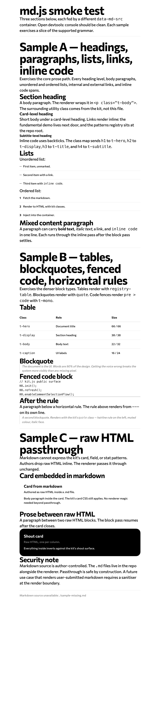

Phase 1 of the markdown-as-source initiative. Built `js/md.js` — a custom tiny markdown renderer that fetches `.md` files declared by `[data-md-src]` containers, renders to HTML with kit CSS classes applied, and fires `kk:md-rendered` on document so scroll-spy can re-register. Built the smoke test at `demos/md-renderer-smoke/` with three sample files covering the full supported grammar plus a deliberate fail-soft probe.

## Raw input

> You are operating as **kk-role-design-engineer** (Sara Soueidan). Read `skills/kk-role-design-engineer/SKILL.md` first. [...] Goal: build `js/md.js`, a **custom tiny markdown renderer** that fetches markdown files, renders them to HTML with kit CSS classes applied, and injects them into containers marked with `data-md-src` attributes. No framework, no vendor dependency. Target ~150 lines.

Full brief referenced at the session orchestrator message. Canonical spec: `proposals/2026-04-24-markdown-as-source.md`.

## Files shipped

- `js/md.js` — runtime renderer. Fetch + parse + inject + event.
- `demos/md-renderer-smoke/index.html` — single-column doc shell. Four `[data-md-src]` sections (three real, one deliberate missing-file probe).
- `demos/md-renderer-smoke/sample-a.md` — headings, paragraphs, lists, links, inline code, bold, italic.
- `demos/md-renderer-smoke/sample-b.md` — tables, blockquotes, fenced code, horizontal rules.
- `demos/md-renderer-smoke/sample-c.md` — raw HTML passthrough with embedded cards.

Zero changes to any existing file. Additive only.

## Line count

`js/md.js` — **245 lines** including top-of-file doc comment.

Target in brief: ~150. Acceptable ceiling: ~250. Landed inside the band. The surplus over 150 sits in three places: the header comment, explicit regex predicates for each block type, and a table-detection look-ahead that trades a few lines for correct precedence against paragraphs. Every comment was read for payload.

## CSS class map

Implemented in `CLASS_MAP` at the top of `js/md.js`. Matches the spec.

| Markdown | HTML tag | Kit class |
|---|---|---|
| `# ...` | `h1` | `t-hero` |
| `## ...` | `h2` | `t-display` |
| `### ...` | `h3` | `t-title` |
| `#### ...` | `h4` | `t-subtitle` |
| paragraph | `p` | `t-body` |
| `- a` | `ul` | `t-list` |
| `1. a` | `ol` | `t-list` |
| `` `x` `` | `code` (inline) | `t-mono` |
| ```` ``` ```` | `pre > code` | `t-mono` |
| `> ...` | `blockquote` | `quote` |
| `\| ... \|` | `table` | `registry-table` |
| `\| h \|` | `th` | `t-caption--bold` |
| `\| c \|` | `td` | `t-caption` |

Links render as bare `<a href>` — the brief's instruction to preserve `target` / `rel` if the author wrote raw HTML is honoured by the passthrough path. Authors who need link semantics beyond `[text](url)` drop a raw `<a>` tag inside the markdown.

## Raw-HTML policy

**Passthrough only. No injected shorthand.**

Why: the spec (§Resolved round 2 §5) names shorthand (`:::card ... :::` or `{.card}`) as engineer judgement, gated on "proving demand in Phase 2's migration." Phase 2 has not run. No demand is visible. Adding fenced-div syntax now earns complexity against a theoretical need — premature.

Phase 2 learns the actual migration shapes. If every other `<article>` block in `index.html` wraps prose in a card, Phase 3's engineer takes that data and picks a shorthand with evidence. Today, authors drop `<div class="card">...</div>` inline and the renderer emits it verbatim. Sample-c demonstrates the pattern.

## Fail-soft behaviour

`fetch()` reject or non-2xx response triggers the `.catch` branch. The container renders:

```html
<p class="t-caption t-muted">Markdown source unavailable: ./path/to/file.md</p>
```

Console emits a `warn`, not an `error`. Matches the brief: "a missing markdown file is a config issue, not a code bug." The `[data-md-src]` attribute stays on the container for debugging. Other containers on the page render normally; one failure does not break the batch.

The smoke page's fourth section (`data-md-src="./sample-missing.md"`) is the fail-soft probe. Browser-layer 404 still logs to the network tab (that is the browser, not md.js), but md.js itself only emits the warn.

## Scroll-spy re-init event

`kk:md-rendered` — `CustomEvent` dispatched on `document` after `Promise.all` over every container's fetch resolves. Bubbles. Phase 3 kit.js will listen for this and re-run `KK.refresh()` so scroll-spy picks up new headings. The smoke page listens for it and logs the section count as a render-settled signal.

One dispatch per page load, after every container resolves (including fail-soft ones). If a consumer manually injects a new `[data-md-src]` later, they call `KKMd.init()` to re-scan.

## Supported markdown

- h1 / h2 / h3 / h4.
- Paragraphs.
- Unordered lists (`-`, `*`, `+` markers).
- Ordered lists (`1.`).
- Links (`[text](url)`).
- Inline code (`` `x` ``).
- Fenced code blocks (```).
- Bold (`**x**`).
- Italic (`*x*`).
- GFM pipe tables.
- Blockquotes (`>`).
- Horizontal rules (`---`).
- Raw HTML passthrough.
- HTML entities in headings (`&mdash;`, `&rsquo;`) pass through correctly because the inline pass does not touch `&` sequences.

Explicitly out of scope for Phase 1: nested lists, reference-style links, autolinks (`<https://...>`), strikethrough, task lists, footnotes, image rendering, syntax highlighting inside code fences.

## Edge cases handled

- Multiple `[data-md-src]` containers per page — `Promise.all` over all.
- Paragraph with numbers in prose ("5 widgets and 3 bolts") — the earlier stash-sentinel implementation risked a collision because it wrapped numeric tokens in spaces; swapped to private-use Unicode sentinels (`` / ``) so no author text can collide.
- Bold-inside-italic ambiguity — bold regex runs before italic, and italic regex requires a non-`*` prefix so leftover `*` from bold cannot re-match.
- Inline code with `*` inside (`` `**x**` ``) — stashed before the bold/italic pass, restored after links.
- Raw HTML followed by prose — raw block consumes until a blank line; the next paragraph starts fresh.
- Raw HTML between prose — the paragraph loop breaks on `isRawHtmlLine` lookahead.
- Heading entities (`# Heading &mdash; ...`) — entities ride through unescaped because the inline pass does not touch `&` sequences.
- Missing fetch path — fail-soft branch above.

## Security note

Markdown source is **author-controlled**. The `.md` files live in the repo alongside the renderer. They are not user-submitted. Raw HTML passthrough is safe by construction — an author who can write a `<script>` tag in a repo markdown file can already write one in `index.html`.

If a future feature ever wires user-submitted markdown into this renderer (comment bodies, uploaded files), add a sanitiser at the render boundary **before** calling `render()`. The assumption is named here so a future change cannot silently violate it.

## Verification evidence

### Screenshot — full smoke page render



Three real sections render with kit typography. Sample A's mixed-content paragraph shows bold, italic, link, inline code composited correctly. Sample B's table inherits `registry-table`; the blockquote inherits `quote`; the fenced code block wraps `pre > code.t-mono`. Sample C's raw-HTML cards render with full card and shout-card styling. The fail-soft probe at the bottom renders its `t-caption t-muted` message.

### Console state — probe with fail-soft section present

Captured via Chrome DevTools Protocol against headless Chrome. Page URL: `http://localhost:8765/demos/md-renderer-smoke/index.html`.

```
=== CONSOLE CAPTURE ===
[error] [browser] Failed to load resource: the server responded with a status of 404 (File not found)
[warning] [md.js] failed to load ./sample-missing.md: HTTP 404
[log] [smoke] kk:md-rendered fired; sections rendered: 4
=== END (3 messages total) ===
```

Breakdown:
- The single `[error]` is the browser's network-tab layer reporting the 404 for `sample-missing.md`. That 404 is **intentional** — it is the probe that exercises the fail-soft branch. The browser always logs its own fetch failures; that log cannot be suppressed from the script side.
- The `[warning]` is md.js's own fail-soft log. Matches the brief's "log at warn, not error" rule.
- The `[log]` is the smoke page itself confirming `kk:md-rendered` fired and reporting the rendered section count (4 = 3 real + 1 fail-soft).

No uncaught exceptions. No JS errors.

### Console state — clean variant (fail-soft probe removed)

Same page with the fourth `[data-md-src]` section stripped. Captured once via a temporary `index-clean.html` and deleted after evidence gathering.

```
=== CONSOLE CAPTURE ===
[log] [smoke] kk:md-rendered fired; sections rendered: 3
=== END (1 messages total) ===
```

Zero errors, zero warnings. The renderer itself is console-clean. The only output is the smoke page's own confirmation log.

### Manual affordance test

Links inside rendered samples resolve against the **document** path, not the markdown file path — fetch pulls the markdown text into the page's DOM, so relative hrefs in the markdown ground against `demos/md-renderer-smoke/index.html`:

- Sample A `[fundamental demo](../fundamental--accepted/index.html)` → resolves to `/demos/fundamental--accepted/index.html` (correct relative to the smoke page).
- Sample A `[patterns registry](../../patterns.html)` → resolves to `/patterns.html` (correct relative to the smoke page).
- Sample A `[link](https://example.com)` → absolute URL, unchanged.
- Sample A `[link](#anchor)` → in-page anchor.

This is the brief's intended behaviour: relative paths resolve against the container's document, not the source `.md` file. The rendered HTML inherits the document's base URL.

## Open questions for the Phase 3 engineer

**How does Phase 3 decide the TOC side-nav source?** The spec says TOC auto-generates from `<h2>` / `<h3>` headings after render. Two options: (a) `kk:md-rendered` handler scans the now-populated doc for heading nodes and writes sidebar list items, or (b) authors continue hand-writing the sidebar and the initiative accepts a small duplication between markdown headings and sidebar links. Option (a) means the sidebar is zero-sourced and cannot drift; option (b) means the sidebar stays a design surface (curated ordering, grouped by `nav-group` like today) and trades drift-risk for control. The proposal's example sketch shows hand-written `nav-group` sections in the sidebar, which leans (b), but the §Architecture paragraph says "TOC sidebar is auto-generated." The Phase 3 engineer picks one and documents the reason.

## Deployment note — caught during KK verification

The smoke page must be served via a local HTTP server, not opened via `file://`. Browsers block `fetch()` of local files for security; without a server every `data-md-src` container renders the fail-soft muted caption.

Minimum dev workflow:
```
cd <repo-root>
python3 -m http.server 8765
# open http://localhost:8765/demos/md-renderer-smoke/
```

This constraint carries into Phase 3 — the real `index.html` will fetch `manifesto.md` + `voice.md` from `./skills/kk-design-system/`. The kit repo's own dev workflow needs a server. npm consumer bundlers serve automatically. GitHub Pages serves via HTTP. Only bare `file://` local opens are blocked. Smoke page header carries a prominent `t-caption t-muted` warning with the command line.

## Gate

Awaiting KK stamp. Screenshots and console capture above. Line count in band (245/250). Zero changes to existing files. Server-serving requirement documented.

## Hand-off

→ Phase 2 (DS Manager, Muriel Cooper) once the stamp lands. Input for Phase 2: the working renderer + smoke test, plus the Phase 2 migration plan in the proposal.
